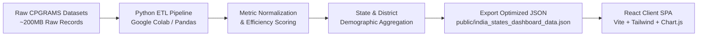

# 🏛️ Public Grievance Redressal Dashboard: Access & Efficiency

[](https://react.dev/)
[](https://vitejs.dev/)
[](https://tailwindcss.com/)
[](https://www.chartjs.org/)
[](https://www.python.org/)
[](https://pandas.pydata.org/)
[](LICENSE)

An interactive, **"no-backend" open-data dashboard** visualizing public grievance redressal efficiency and citizen demographic access trends across Indian states using pre-COVID **CPGRAMS** (Centralised Public Grievance Redress and Monitoring System) data.

---

## 📌 Table of Contents

- [About the Project](#-about-the-project)
- [Key Features](#-key-features)
- [The Math: Custom Efficiency Metric](#-the-math-custom-efficiency-metric)
- [Tech Stack](#-tech-stack)
- [Data Pipeline Architecture](#-data-pipeline-architecture)
- [Project Directory Structure](#-project-directory-structure)
- [How to Run Locally](#-how-to-run-locally)
- [Screenshots & Visuals](#-screenshots--visuals)
- [Team Members](#-team-members)
- [License](#-license)

---

## 📖 About the Project

Public grievance redressal is a cornerstone of responsive governance. However, high-level reporting often presents a distorted view:

1. **Misleading Throughput:** High disposal rates frequently conceal years-old unresolved cases languishing in backlogs.
2. **The Gender Digital Divide:** Aggregate registration counts fail to reveal whether e-governance channels are equally accessible across genders and rural administrative districts.

This project delivers a **transparent, client-side analytical dashboard** that transforms raw public records into actionable intelligence. By evaluating administrative regions on both **throughput velocity** and **case aging penalties**, the platform offers citizens, researchers, and policymakers an honest perspective on institutional responsiveness.

---

## ✨ Key Features

- **⚖️ Balanced Efficiency Ranking:** Evaluates administrative efficiency using an adjusted metric that rewards current disposal velocity while actively penalizing long-standing stagnation (> 1 year).
- **👥 Demographic Access & Gender Divide:** Unpacks citizen participation by state and district, revealing gender ratios and highlighting disparities in digital portal adoption.
- **📈 Interactive Time-Series Analytics:** Visualizes multi-year registration trends using smooth Chart.js line charts to identify seasonal grievance spikes and policy rollouts.
- **📍 Hyper-Local District Volume:** Breaks down top administrative districts per state by cumulative volume and percentage share.
- **⚡ Serverless "Zero-Backend" Speed:** Uses an optimized, pre-aggregated JSON document as a lightweight client-side datastore, achieving sub-second loads without server overhead or database hosting costs.

---

## 📐 The Math: Custom Efficiency Metric

Conventional rankings rely on raw **Disposal Rate** (`Disposed / Receipts`), which incentivizes clearing quick, low-hanging complaints while ignoring difficult, aged cases. Our model uses a **"Goldilocks" penalization formula** to rank states objectively:

$$\text{Disposal Rate (\%)} = \left(\frac{\text{Disposed Grievances}}{\text{Receipts}}\right) \times 100$$

$$\text{Long-Pending (\%)} = \left(\frac{\text{Grievances Pending } > 1 \text{ Year}}{\text{Total Pending Grievances}}\right) \times 100$$

$$\mathbf{Efficiency\ Score = \text{Disposal Rate (\%)} - (0.5 \times \text{Long-Pending (\%))}}$$

### Why a $0.5$ Penalty Weight?

The weight factor was empirically calibrated to establish accountability without unfair distortion:

| Weight Factor                     | Effect on State Rankings                                                                                                                              | Assessment                    |
| :-------------------------------- | :---------------------------------------------------------------------------------------------------------------------------------------------------- | :---------------------------- |
| **$\lambda = 1.0$**               | Heavily penalizes states burdened by historical case backlogs, completely erasing commendable recent clearance performance.                           | ❌ Overly Punitive            |
| **$\lambda = 0.25$**              | Barely registers neglected complaints; allows backlogged states to claim top ranks through short-term volume surges.                                  | ❌ Too Lenient                |
| **$\lambda = 0.50$** _(Selected)_ | **The "Goldilocks" Balance.** Fairly rewards high throughput while ensuring that chronic stagnation (>1 year) drags down a state's national standing. | ✅ **Optimal Accountability** |

---

## 🛠️ Tech Stack

### Frontend & Visualization

- **Core Framework:** [React 18](https://react.dev/) via [Vite](https://vitejs.dev/) (Fast HMR, ES modules)
- **Styling:** [Tailwind CSS](https://tailwindcss.com/) (Modern SaaS utility palette: slate, blue, emerald, amber)
- **Data Visualization:** [Chart.js 4](https://www.chartjs.org/) & [react-chartjs-2](https://react-chartjs-2.js.org/)
- **Icons:** [Lucide React](https://lucide.dev/)

### Data Pipeline & Pre-computation

- **Language:** [Python 3.10+](https://www.python.org/)
- **Data Engineering:** [Pandas](https://pandas.pydata.org/) & [NumPy](https://numpy.org/)
- **Environment:** Jupyter Notebooks / Google Colab
- **Output:** Lightweight nested JSON (`india_states_dashboard_data.json`)

---

## 🔄 Data Pipeline Architecture



1. **Extraction & Standardization:** Loads multi-source tabular data (`df_overall`, `df_age`, `df_users`, `df_trend`) and standardizes state identifiers and naming conventions.
2. **Metric Computation:** Calculates disposal ratios, long-standing backlog percentages, and derived national ranks.
3. **Demographic Slicing:** Extracts gender breakdowns and top 15 administrative districts sorted by citizen adoption.
4. **Serialization:** Generates an indexed, nested schema written directly into `public/india_states_dashboard_data.json` for client-side consumption.

---

## 📁 Project Directory Structure

```text
grievance-redressal-dashboard/
├── public/
│   └── india_states_dashboard_data.json  # Pre-computed client datastore (~96 KB)
├── src/
│   ├── App.jsx                           # Primary dashboard view & state logic
│   ├── main.jsx                          # React application root
│   └── index.css                         # Tailwind CSS base & typography
├── index.html                            # HTML entry point with Inter font
├── package.json                          # Dependencies & build scripts
├── postcss.config.js                     # PostCSS configuration
├── tailwind.config.js                    # Tailwind styling configuration
├── vite.config.js                        # Vite bundler configuration
└── README.md                             # Documentation
```

---

## 🚀 How to Run Locally

### Prerequisites

- [Node.js](https://nodejs.org/) (v18.0 or later recommended)
- [npm](https://www.npmjs.com/) (bundled with Node)

### 1. Clone the Repository

```bash
git clone https://github.com/your-username/grievance-redressal-dashboard.git
cd grievance-redressal-dashboard
```

### 2. Install Dependencies

```bash
npm install
```

### 3. Launch Development Server

```bash
npm run dev
```

Open your browser and navigate to **`http://localhost:5173/`** (or the port indicated in your terminal).

### 4. Build for Production

```bash
npm run build
```

Production assets will be generated in the `dist/` directory, ready to deploy to Vercel, Netlify, or GitHub Pages.

---

## 👥 Team Members

| Name              | Role                            | GitHub / Contact                   |
| :---------------- | :------------------------------ | :--------------------------------- |
| **Mohan Prasath** | Lead Developer & Data Architect | [@Thejashree](https://github.com/) |
| _Team Member 2_   | _Role Placeholder_              | [@username](https://github.com/)   |
| _Team Member 3_   | _Role Placeholder_              | [@username](https://github.com/)   |

---

## 📄 License

This project is licensed under the **MIT License** — see the [LICENSE](LICENSE) file for details.
All grievance data utilized is sourced from public open-data records published under the Open Government Data (OGD) Platform India.
